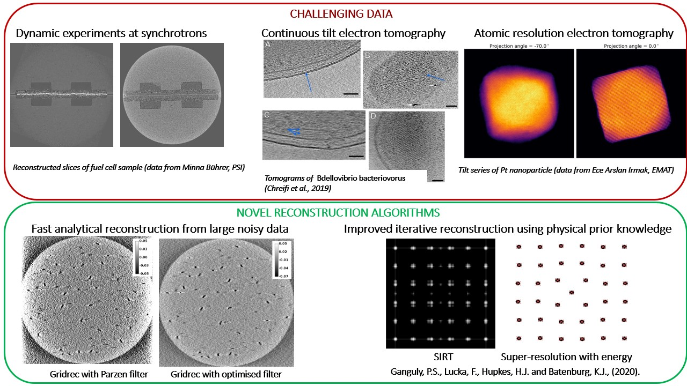

## Atomic super-resolution tomography ##

In this project, we consider the problem of reconstructing a nanocrystal at atomic resolution from very few electron microscopy images. 

In several popular reconstruction approaches, atom locations are confined to a coarse spatial grid, an assumption inspired by the physical a priori knowledge that atoms in a crystalline solid tend to form regular lattices. This constraint, although powerful in solving under-determined problems, makes it much harder to resolve defects that occur widely in atomic lattices. 

We take inspiration from recent advances in mathematical super-resolution to propose a *grid-free* reconstruction approach that allows for continuous deviations of atom locations. This new formulation also allows us to use atomic interaction potentials as a function of atom positions as a physics-based regulariser.

Take a look at our SIAM [poster](https://poulamisganguly.github.io/poster_IS20/) or check out our [preprint](https://arxiv.org/abs/2002.00710) for more details!

## Ultrafast reconstruction using Fourier domain filters ##
In this project, we look at the tomographic problem of reconstructing a 3D object from its 2D projections taken at various angles. Analytical algorithms, such as filtered backprojection in real space and Gridrec in Fourier space achieve reconstruction by direct inversion of the Radon transform. A crucial step in these algorithms is the frequency-dependent filtering of projections. 

Standard filters are independent of the scanned object's features, noise levels in the data and acquisition geometries. Thus, when projection data are noisy or limited in angular range, direct algorithms give poor results. In contrast, iterative algorithms, such as Kaczmarz's method, yield better reconstructions for imperfect data. However, due to their long computation times, the use of such algorithms in ultrafast acquisition settings is challenging. 

In order to achieve ultrafast reconstructions from large noisy data, we propose an approach that combines the speed of direct Fourier-domain methods with the accuracy of iterative algorithms. We achieve this by optimising the filters used in analytical algorithms to the available data in an iterative fashion. These filters, once optimised, can be used on-the-fly and can be applied to different objects scanned under the same noise conditions. Possible use cases for our approach are time-resolved experiments at the synchrotron and continuous-tilt electron tomography.
